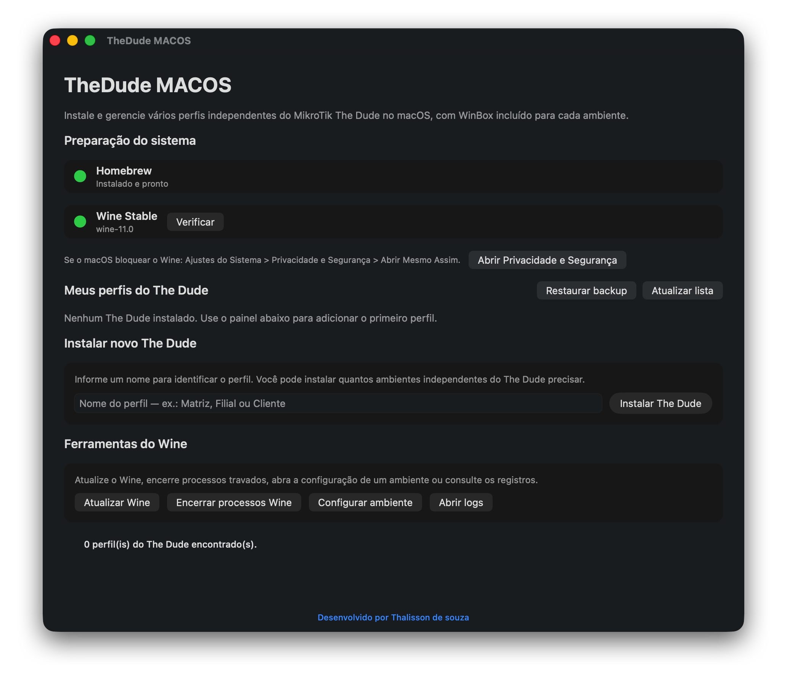

# 🖥️ TheDude MACOS

> A practical way to install and manage MikroTik The Dude on Apple Silicon Macs.

**Apple Silicon** • **The Dude 7.23.3** • **WinBox included** • **Isolated profiles** • **Backup and restore**

<p align="center">
  
</p>

**TheDude MACOS** installs and manages MikroTik The Dude on Apple Silicon Macs. Every installation gets its own isolated Wine environment, virtual C: drive, custom name and Dock shortcut — all controlled through a friendly interface, with no Terminal window required during everyday use.

## ✨ Highlights

| Feature | What it does |
|---|---|
| 🧩 Independent profiles | Create Headquarters, Branch, Customer A and as many environments as you need. |
| 🪟 WinBox included | Copies `winbox.exe` directly to the C: drive of each profile. |
| 🚀 Dock shortcuts | Open each Dude using its custom name without a Terminal window. |
| 💾 Backup and restore | Protect connections, preferences and the complete virtual C: drive. |
| 🛠️ Built-in maintenance | Repair shortcuts, update Wine, inspect logs and stop stuck processes. |
| 🍎 Apple Silicon ready | Designed for M1, M2, M3, M4 and newer Macs. |

## 🧭 Quick navigation

- [Requirements](#-requirements)
- [First launch](#-first-launch)
- [Install a profile](#-install-your-first-the-dude-profile)
- [Install and configure WinBox](#-install-winbox-in-a-profile)
- [Backup and restore](#-backup)
- [Troubleshooting](#-troubleshooting)
- [Support the project](#-help-the-project-grow)

## ✅ Requirements

- Mac with an Apple M1, M2, M3, M4 or newer processor.
- macOS 13 or newer.
- Internet connection during the initial setup.
- An administrator account to install Homebrew and Wine.
- Enough free storage for your The Dude environments.

## 📦 Package contents

- `TheDude MACOS.app`: the main management dashboard.
- Bundled MikroTik The Dude 7.23.3 installer.
- Bundled `winbox.exe`.
- Dock shortcut generator.
- Backup, restore, repair and uninstall tools.
- `README.md`: Portuguese documentation.
- `README-EN.md`: English documentation.
- `docs`: screenshots and the project donation QR Code.

Wine is not bundled in the ZIP because all profiles share the system installation. It only needs to be prepared once on each Mac.

## 🚀 First launch

1. Extract the ZIP file.
2. Open `TheDude MACOS.app`.
3. Check Homebrew under **System preparation**.
4. If Homebrew is red, click **Install**.
5. Complete the installation in Terminal. When macOS asks for your password, type it and press Return. The password is not displayed while you type.
6. Return to TheDude MACOS.
7. When Homebrew is green, install Wine Stable.
8. Click **Check** to confirm that Wine is authorized.

Once this preparation is complete, you can add new profiles without repeating these steps.

## 🔐 If macOS blocks Wine

If macOS says Apple cannot verify Wine:

1. Do not select **Move to Trash**.
2. Click **OK**.
3. Open **System Settings > Privacy & Security**.
4. Find the Wine Stable security message.
5. Click **Open Anyway**.
6. Confirm with your password or Touch ID.
7. Return to TheDude MACOS and click **Check**.

The **Open Privacy & Security** button takes you directly to the correct System Settings page.

## ➕ Install your first The Dude profile

1. Find **Install new The Dude**.
2. Enter a descriptive name such as `Headquarters`.
3. Click **Install The Dude**.
4. Wait for the confirmation message.

The manager creates:

- An isolated Wine environment.
- A dedicated virtual C: drive.
- A Dock shortcut with the Windows-on-Mac icon.
- A visible name such as `The Dude - Headquarters`.

Internal data is stored under:

```text
~/Library/Application Support/TheDude-1
```

## 🧩 Install additional profiles

Repeat the installation with another name, such as `Downtown Branch`. The next profile is stored as `TheDude-2`, then `TheDude-3`, and so on. Profiles do not share preferences or connection data.

The manager does not impose a profile limit; available disk space is the practical limit.

## 🪟 Install WinBox in a profile

WinBox is already bundled with TheDude MACOS. You do not need to browse for the file manually.

1. Find the desired profile card.
2. Click **Install WinBox**.
3. Wait for the confirmation.

The file is copied directly to:

```text
C:\winbox.exe
```

Each profile has a separate C: drive, so run **Install WinBox** for every profile that needs it. If a previous file exists, it is moved to Trash and replaced with the bundled version.

## 🔧 Configure WinBox in The Dude Tools

Open the **Tools** configuration in The Dude and use:

```text
"C:\winbox.exe" "[Device.FirstAddress]" "[Device.UserName]" "[Device.Password]"
```

To pass only the device address, use:

```text
"C:\winbox.exe" "[Device.FirstAddress]"
```

## 🎛️ Profile buttons

- **Open**: starts The Dude without opening Terminal.
- **Open C: drive**: displays the profile's virtual disk in Finder.
- **Install WinBox**: copies the bundled WinBox to `C:\winbox.exe`.
- **Repair shortcut**: rebuilds the Dock application without deleting profile data.
- **Rename**: changes the name displayed in the dashboard and Dock.
- **Backup**: creates a ZIP containing the complete profile environment.
- **Uninstall**: moves the profile and its shortcut to Trash.

## 🔄 The Dude automatic updates

During an update, The Dude may close the current window and start another one. The generated shortcut waits for Wine to complete this sequence so the application can reopen normally.

If an update becomes stuck, use **Stop Wine processes** and open the profile again.

## 💾 Backup

1. Close the profile.
2. Click **Backup** on its card.
3. Choose where to save the ZIP.
4. Wait for confirmation.

The backup contains the C: drive, installed WinBox, preferences, saved connections and the remaining environment data. Treat backups as sensitive because they may contain saved credentials.

## ♻️ Restore a backup

1. Click **Restore backup**.
2. Select a ZIP created by TheDude MACOS.
3. Wait for restoration to finish.

The restored profile receives the next available internal number and does not replace existing profiles.

## ✏️ Rename a profile

Click **Rename**, enter the new name and select **Save**. The physical application name and Dock entry are updated while connections and preferences remain unchanged.

Names are required, may contain up to 50 characters and cannot include `&`, `<`, `>`, `/`, `\` or `:`.

## 🗑️ Uninstall a profile

1. Close the corresponding The Dude profile.
2. Click **Uninstall**.
3. Confirm the action.

The complete environment and shortcut are moved to Trash. Other profiles are not affected, and the data remains recoverable until Trash is emptied.

## 🧰 Wine tools

- **Update Wine**: checks for a newer Homebrew version.
- **Stop Wine processes**: closes stuck processes from managed environments.
- **Configure environment**: lets you select a profile and open `winecfg`.
- **Open logs**: opens diagnostic log files.

## 🧳 Move the kit to another Mac

Copy the portable ZIP to another Apple Silicon Mac, extract it and open `TheDude MACOS.app`. Homebrew and Wine must be prepared on that Mac, while the The Dude and WinBox installers are already bundled.

You can then install new profiles or restore your existing backups.

## 🩺 Troubleshooting

### Wine was blocked

Open **System Settings > Privacy & Security > Open Anyway**, then return to the manager and click **Check**.

### The Dude does not open

1. Click **Stop Wine processes**.
2. Click **Repair shortcut** on the affected profile.
3. Try opening it again.
4. Use **Open logs** if the issue continues.

### WinBox does not appear in Tools

Confirm the command uses exactly `C:\winbox.exe` and that **Install WinBox** was run for that specific profile.

### An old name or icon remains in the Dock

Close the profile and click **Repair shortcut**. TheDude MACOS refreshes Launch Services, icon metadata and the Dock entry without reopening minimized windows.

## 🛡️ Security

- Do not disable Gatekeeper globally.
- Keep macOS, Homebrew and Wine updated.
- Protect backups that may contain addresses, usernames and passwords.
- Only use a TheDude MACOS package obtained from a trusted source.

## 💙 Help the project grow

If **TheDude MACOS** made your work easier, consider supporting the project with a donation of any amount. Your contribution helps maintain the application, fix issues, develop improvements and make The Dude even easier to use on a Mac. 🚀

### Pix key

```text
65e1147b-43b4-4b5f-9272-419f0ac8c526
```

Scan the QR Code below using a Brazilian banking application:

<p align="center">
  
</p>

> Every contribution makes a difference. Thank you for supporting the project! 🙏💙

## 👨‍💻 Developer

Developed by [Thalisson de Souza](https://www.linkedin.com/in/thalisson-de-souza/).
